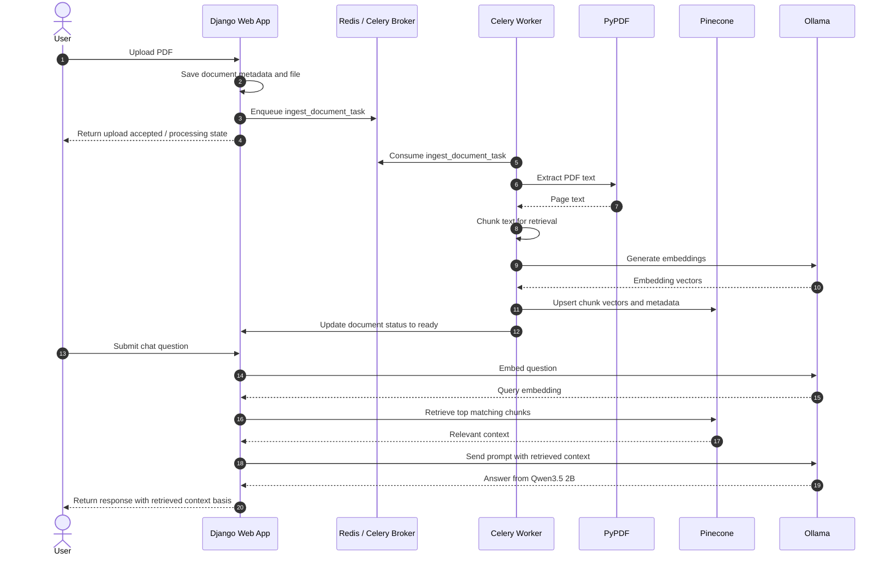

# django-rag

A Django-based RAG knowledge base demo with local Qwen3.5 2B generation, asynchronous PDF ingestion, Pinecone vector retrieval, and a template-based chat interface.

## Overview

This high-level sequence diagram illustrates the main interactions between components in the system:



## Demo

In order to test the demo, the repository includes a Docker Compose stack for PostgreSQL, Pinecone, Redis, Ollama, the Django demo-app, and the Celery worker. Ollama models are cached in a named volume to prevent re-downloading models. Give the stack some time to settle and then head to `http://localhost:8000` to access the demo interface. You can upload PDFs, which will be processed asynchronously, and then ask questions about their content.

The default stack uses `OLLAMA_EMBED_MODEL=nomic-embed-text`, which produces 768-dimensional embeddings. If you switch embedding models, keep `PINECONE_DIMENSION` aligned with the model output and recreate the local index if it was already created with a different size.

```bash
docker compose up --build
```

If you run into a situation where the Ollama container refuses to start due to a model download issue, you can enter the container and run the model pull command manually to see more detailed error messages:

```bash
docker compose exec ollama bash
ollama pull llama3.2:3b  # or whatever model you are using
ollama pull nomic-embed-text
```
